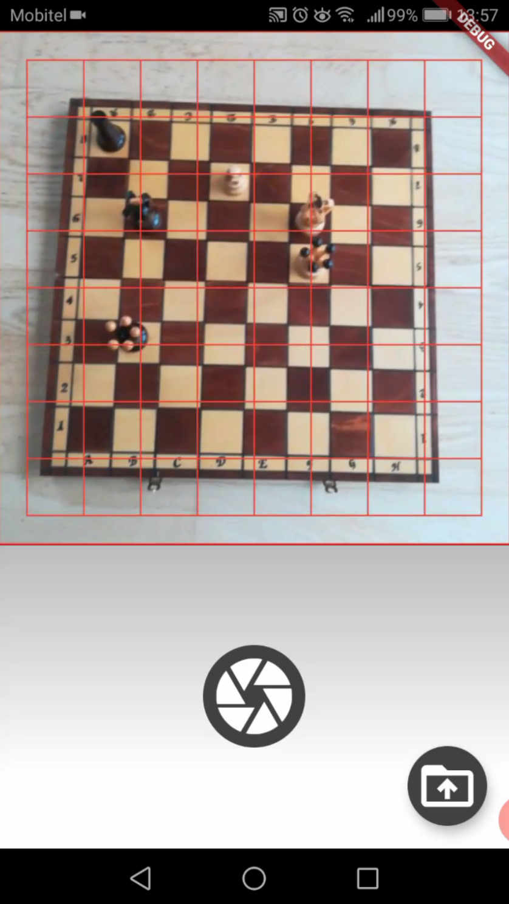
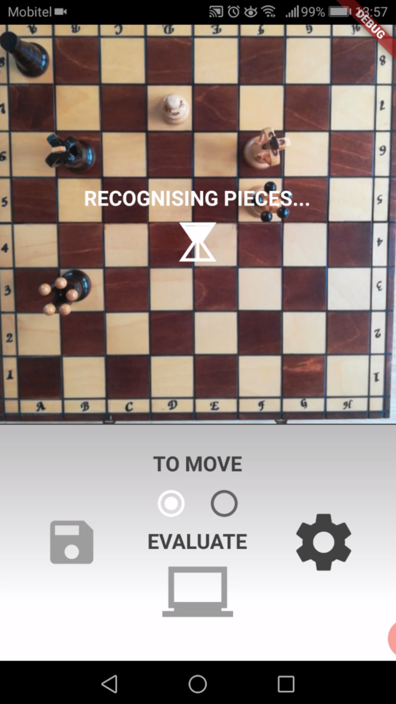
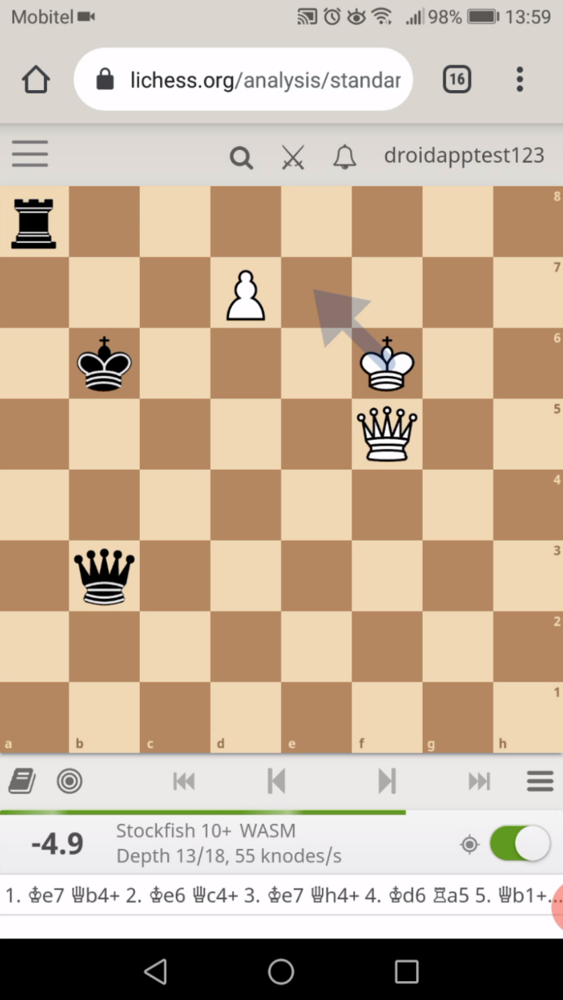
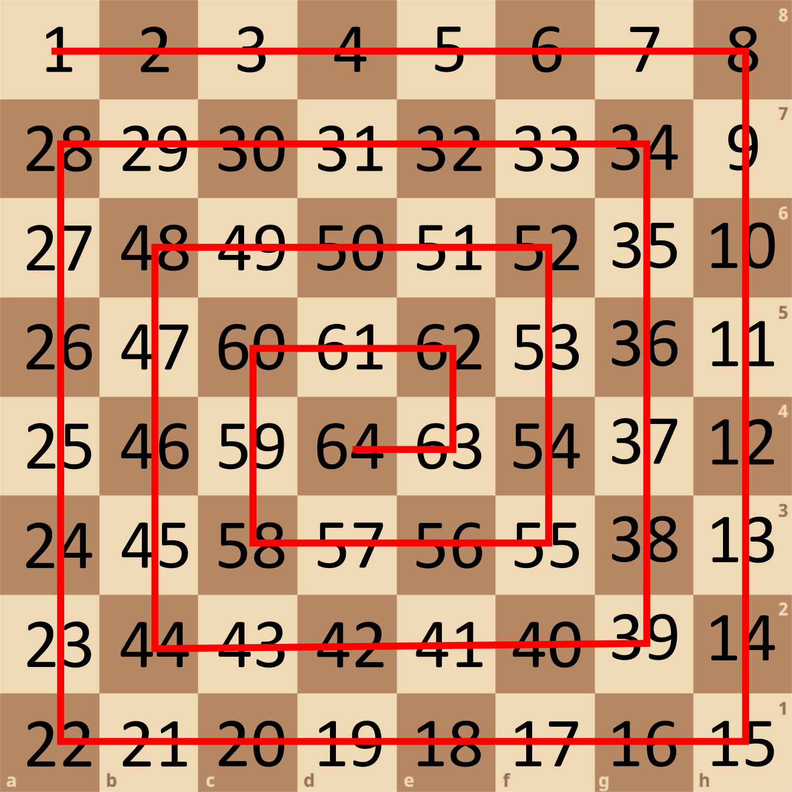

# Chess-Object-Detection-YOLOv4

### Watch the presentation of the whole procedure of creating the chess pieces object detection model, position digitiser and smartphone application in this [YouTube video](https://www.youtube.com/watch?v=Tj1lcSwxBYY).

  
  
  
  

In-depth, step-by-step explanation for some of the steps is given in the Jupyter Notebooks. In the following, instructions on how and when to use the files uploaded in this repository are given. For visual presentation of each step, watching the above Youtube video is recommended.

# CHAPTER 1: CAPTURING PHOTOS OF THE CHESS PIECES 

The purpose of this step is creating images that can be used with a photogrammetry software to create 3D models of the pieces. I used the so-called "Void method". Watch this video for more details on this method:
- [**Erik Christensen:** Scanning in the Void - A short video on good turntable setups](https://www.youtube.com/watch?v=Il6LVXqSlRg)

Photogrammetry softwares rely on background features to calculate the camera positions for each image. For this reason, the object must be at rest while the camera moves around it. The point of the "Void method" is to create images that have no features in the background. In this case, the only image features that the photogrammetry software can use are the features on the piece itself. Main advantage of this method is that you can use a turntable and spin the piece while the camera is at rest. I used a homemade turntable. If you want to create your own as well, you can use either one of my rotation clocks in images _ROTATION-CLOCK-16.png_ and _ROTATION-CLOCK-24.png_. In general, photogrammetry is very delicate work. Many things can (and will) go wrong. If you do not have the photography equipment, required for the "Void method", you can use normal photogrammetry. Two excellent videos on this subject:
- [**Switch & Lever:** How to Copy (almost) Any Object](https://www.youtube.com/watch?v=0WTns1ItVss) 
- [**CG Geek:** How to 3D Photoscan Easy and Free!](https://www.youtube.com/watch?v=k4NTf0hMjtY)

In general, the object that you want to scan, must not be reflective, transparent, symmetric, cylindrical or black. It is also better, that the object covers as much of the image as possible. For this reason, cropping images is strongly recommended. Note that photogrammetry softwares require information about the images e.g. camera model, focal lenght, sensor width, exposure time, F-number, ISO, lens focal lenght. They use the help of this information when calculating camera positions. This information is saved in the metadata of each image after the photo is taken. WIth that in mind, it is important to preserve this data, when cropping the images. For this reason, I created the _Original-Images-Cutter-Preserve-Exif.ipynb_ Notebook. It uses the PIL image library which preserves the mentioned information. 

# CHAPTER 2: PHOTOGRAMMETRY - CREATION OF 3D MODELS OF THE PIECES

The purpose of this step is to create 3D models (.obj) of the pieces, using captured images. There are many photogrammetry softwares out there that you can use. Some of the best/easy available are (in the order of "1: strongly recommend" to "4: if others do not work":

1. [Agisoft Metashape](https://www.agisoft.com/) (30 day free licence!)
2. [3DF Zephyr Free](https://www.3dflow.net/3df-zephyr-free/) (free)
3. [COLMAP](https://colmap.github.io/) (free)
4. [AliceVision Meshroom](https://alicevision.org/) (free, open source)

Agisoft Metashape is probably at least 5 levels above Meshroom, since it provides many tools for camera recalibration and position recalculation. Meshroom is on this list only because it is so easily accesible. A decent graphics card is required to operate these softwares. I used NVIDIA GeForce GTX 1050 and it worked smoothly without any problem. If you do not own graphics card that is good enough, you can use:

- [Meshroom on GoogleColabratory](https://gist.github.com/donmahallem/22134574382b7bd8a67c1550734fcfc4) 

The downside of this option is that you can only run the default pipeline and no changes can be made. Last resort options are also photogrammetry services, e.g.:

- [MaxCoundOn](https://photogrammetry.maxcloudon.com/)

Pices I used are somewhat reflective, symmetrical and dark (the black ones) and the results were not always perfect. I used Blender 3D modeling software to manually correct the ones that needed corrections. I also exported .fbx file for each model, which I later used for rendering.

# CHAPTER 3: RENDERING OF CHESS PIECES 3D MODELS

The purpose of this step is to create many transparent images of each piece that can be later used for synthetic data generation. I recommend using Blender, since it is one of the 3D modeling softwares that support Python. The 3D models are in the _Blender/_ folder along with _Render-pieces.blender_ file and corresponding _Render-pieces_ Python script. To render images for each piece, follow the steps:
1. Import the piece (.fbx) you want to render and select/activate it (click on it, it must be highlighted), 
2. make sure that its render view is activated (camera icon next to piece name in the Scene Collection)
3. and run the script (alt+p).

The script will create keyframes for all 64 positions and all 16 rotations (1024 keyframes). 

4. Choose render output folder and press Render Animation (ctrl + f12).

Each image will be named after its keyframe (e.g. 420.png). Use _Rename-Blender-Render-Images.ipynb_ to rename the images into 'piece-index_chess-field_rotation.png' format. Chess fields are numbered in the spiral shape, starting at a8 and going to h8, h1,... 

The reason for this is that when the pieces are overlayed on the chessboard, no overlapping can occur, since fields are filled in the order from the lowest number to the highest, meaning from the outside of the chessboard to the middle.

# CHAPTER 4: SYNTHETIC DATA GENERATION

The purpose of this step is to create data that will be later used for training of the object detection model. Besides each image, a textfile with boudingboxes and corresponding labels is needed. To generate synthetic data use _Create-Synthetic-Data.ipynb_ Notebook. It includes very detailed description of what is going on in each step.

# CHAPTER 5: TRAINING OF THE OBJECT DETECTION MODEL

The purpose of this step is to train the chess pieces object detection model. I used [Darknet](https://github.com/AlexeyAB/darknet) YOLOv4 Convolutional Neural Network, which is one the most accurate real-time object detection algorithms. I used GoogleColabratory to train the model. Configuration files I used are in the _YOLOv4/_ folder. First-class tutorial along with the Colab Notebook is accesible on this link:

- [**The AI Guy:** YOLOv4 in the CLOUD: Build and Train Custom Object Detector (FREE GPU)](https://www.youtube.com/watch?v=mmj3nxGT2YQ)

The model outcome is in the .weights format. In order to use is it in the smartphone application, conversion into .tflite format is neccessary. Code and tutorial on how to convert model from .weights to .tflite format:

- [GitHub: hunglc007](https://github.com/hunglc007/tensorflow-yolov4-tflite)

# CHAPTER 6: CHESS POSITION EVALUATOR SMARTPHONE APP

I wrote the smartphone application in Flutter, which is a toolkit that allows compiling code to both Android and iOS devices.

### Code and instructions for application coming soon...

# Future ideas and projects:

- Find a way to create smaller models (<50 Mb),
- Different chess sets recognition models (from 3D models of the pieces found online),
- Recognition from an arbitrary angle,
- Implementation of Stockfish into the Flutter app,

